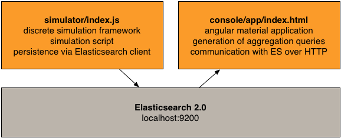
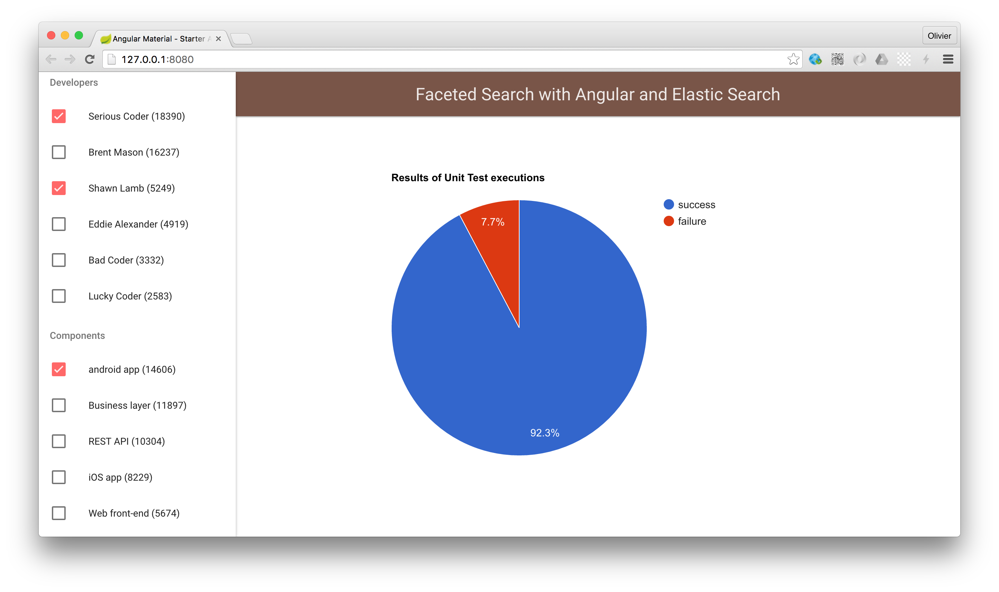

# Playground Elasticsearch

This repo contains several components that I have created to experiment with Elasticsearch. My goal was to develop a complete system to show that is is possible to implement a multi-facet search interface with Elasticsearch in the back-end and AngularJS in the front-end.




## Requirements

To use this code, you need to have an Elasticsearch server installed on your machine. In the first implementation, the reference to localhost:9200 is probably hard-coded in a number of places. To use a Docker-based installation, this would need to be cleaned up.

You also need a standard NodeJS installation with npm and bower, but nothing special.

## Generating data

In order to test the multi-facet UI, we obviously need a data set. In other words, we need a set of business entities with properties. The UI should allow us to reduce the set by applying successive filters on the data.

I have written a discrete simulation framework that generates a stream of events and that persists these events in Elasticsearch. The script written on top of the simulation framework simulates the activities of a software development activity.

To generate data, do the following

```
$ cd simulator
$ node index.js
```

This will start the simulation and issue indexing requests to Elasticsearch. Be aware that this is code is fragile at the moment: if Elasticsearch get too busy and does not answer an indexing request within 30 seconds (default timeout value for the JS client), the event will simply be ignored. If you see related warnings in the console, this is not really a blocking issue: our goal is to have enough data in Elasticsearch to experiment the UI, so if some events get dropped, it is acceptable in this use case.

## Exploring data

The visualization is implemented in AngularJS. To access the app, you first need to start an HTTP server, by doing:

```
$ cd console/app/
$ live-server
```

You will then see something like this in your browser:



In the left pane, you have 3 types of controls to apply filters: 1) an auto-complete text field, 2) an auto-complete text field with chips and 3) check-boxes. The reason is only because I wanted to experiment with these variations, but in a real application, you would pick on of the three options for a given facet.

This is also why the JavaScript code needs serious cleanup (the synchronization between the 3 types of controls is very hacky at the moment).